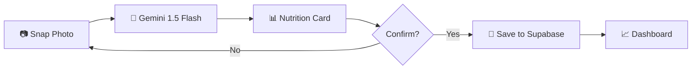
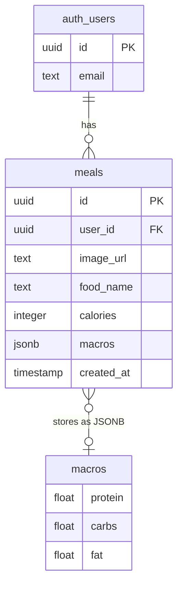

<div align="center">

# NutriVision

**AI-Powered Nutrition Tracking PWA**


Snap a photo. Track your nutrition. That simple.

<!-- Uncomment when you have a screenshot:

-->

</div>

---

## Tech Stack


| Layer | Tech | Notes |
|-------|------|-------|
| Frontend | React + Vite + Tailwind CSS | Mobile-first PWA |
| PWA | vite-plugin-pwa + Workbox | Offline support, installable |
| Backend/BaaS | Supabase | Auth, PostgreSQL, Storage |
| AI Vision | Gemini 1.5 Flash API | Fast, low-cost food analysis |
| Icons | Lucide-react | Clean icon set |

## Features

- **AI Photo Analysis** — Snap a photo of your meal → get instant calorie and macro breakdown
- **Smart Dashboard** — Weekly tracking with progress charts vs daily goals
- **Offline Mode** — PWA with service workers for use without internet
- **Camera Integration** — Native camera capture or file upload
- **Confirmation Flow** — AI results shown as a review card before saving

## How It Works



## Data Model



## Setup

```bash
git clone https://github.com/maur-ojeda/NutriVision.git
cd NutriVision
npm install
```

Create a `.env` file (see `.env.example`):

```env
VITE_SUPABASE_URL=your_supabase_url
VITE_SUPABASE_ANON_KEY=your_supabase_anon_key
VITE_GEMINI_API_KEY=your_gemini_api_key
```

```bash
npm run dev
```

> **Note:** You need a [Supabase](https://supabase.com) project and a [Google AI Studio](https://aistudio.google.com) API key. Never commit your `.env` file.

## Architecture

```
React PWA (Vite + Tailwind)
    ↓
Supabase Client SDK
    ├── Auth (Magic Link / Email)
    ├── PostgreSQL (meals history)
    └── Storage (food images)
    ↓
Gemini 1.5 Flash API (AI food analysis)
    ↓ (returns JSON: food, calories, macros)
```

## License

[MIT](./LICENSE)
